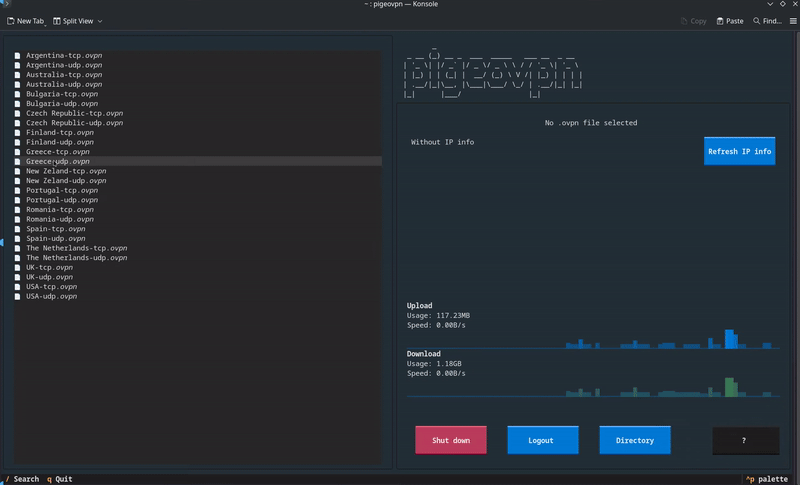

<p align="center">
 
</p>

# pige.ovpn
A TUI that makes it easier to connect to VPNs and monitor network usage.

Designed for Linux distributions.

##  Features
- Connect to/Disconnect from VPN.
- Show IP information (IP address, city, country).
- Monitor network usage.
- Works with all VPN providers that offer OpenVPN configuration files.

## Prerequisites
- Python 3.9 or above.
- A supported terminal emulator:
    - gnome-terminal
    - konsole
    - x-terminal-emulator
    - xfce4-terminal
    - alacritty
    - terminator
    - kitty
    - mate-terminal
- OpenVPN installed on your system.

## Installation
#### pipx installation (recommended)
`pige.ovpn` is available on PyPI and can be installed with **pipx**:

```bash
pipx install pigeovpn
```

Launch it with:

``` bash
pigeovpn
```

#### pip installation
You can also use **pip** (`pip install pigeovpn`) but it is <u> strongly discouraged </u> for avoiding dependency issues.

## How the app works
### First run
The first time you run the app, you will see the welcome screen: 


From there, you will be asked to:
- Provide your VPN provider credentials (username and password). 
This will create a `credentials.txt` file in `/etc/openvpn/`  
- Select the directory where your `.ovpn` configuration files are located.

Once these steps are completed, the main screen will appear:
[photo of the main app]

### Main app
The UI is divided into two main panels:

- **Left panel:** shows all `.ovpn` files found in the configured directory.
- **Right panel:** status, network information, and control panel.

Press `s` to search dynamically through the available configuration files.  


To connect to a VPN, select a file and press `Enter` (or click on it).


By default, IP information is not automatically fetched until a VPN profile is selected.  
You can manually refresh it at any time by pressing `Refresh IP info`.

Press `q` to exit the app.

⚠️ **Important:** quitting does not stop the VPN connection. **OpenVPN will continue running in the background**.

### Technical characteristics
#### sudo commands
The app requires sudo privileges to:
- connect to an `.ovpn` configuration.
- disconnect OpenVPN.
- create the credentials file.

For security and operational reasons, **the app itself isn't run with sudo privileges**. 
Instead, whenever a sudo command is required, a new terminal window appears and prompts the user for the sudo password. 

Although this can be frustrating as it will ask for the password every time a new connection is made, it ensures:
- the sudo password isn't stored in memory
- incorrect passwords are handled by the system prompt (the user is re-asked automatically)

The app will try to open the first supported terminal emulator available from the configured list (see `constants.py`) and execute the required command in that terminal.


## Troubleshooting
### When I try to connect, I enter my sudo password but get an 'AUTH FAILED / authentication' error.
This usually means your VPN credentials (username/password) are incorrect.

Try one of the following:
- Log out from the app and enter your credentials again.
- Manually create/update the credentials file (default location: `/etc/openvpn/credentials.txt`).

### The connection succeeds, but my traffic is not going through the VPN.
This is often caused by invalid credentials, even if OpenVPN does not immediately fail.

Try re-entering your credentials (log out and log back in), or manually update the credentials file at:

`/etc/openvpn/credentials.txt`

If the issue persists, please open a GitHub Issue and include the OpenVPN output log.

### The city and/or country are incorrect.
`pige.ovpn` uses **[API NAME / WEBSITE]** to fetch IP geolocation data.

If too many requests are made in a short period of time, the app may fall back to (**[SECOND API NAME]**), which may be less accurate depending on the free plan limits.

In future versions, support for custom IP lookup APIs may be added.

## FAQs
### Does pige.ovpn store my credentials?
Yes. `pige.ovpn` stores your VPN username and password locally so it can authenticate OpenVPN connections without asking every time. 
The credentials are saved in a plain text file (`/etc/openvpn/credentials.txt`) which is **protected by proper permissions** (`chmod 600`).

### Does quitting the app stop the VPN?
No. Exiting `pige.ovpn` does **not** stop OpenVPN.

If you quit the app, the VPN connection will remain active and OpenVPN will continue running in the background until you manually disconnect (or kill the OpenVPN process).

### Why pige.ovpn and how is it pronounced?
`pige.ovpn` takes its name from the pigeon bird, and it is pronounced like the bird:

**"pigeo-VPN"** (pi-jee-oh + VPN).

Pigeons can be found almost everywhere, and racing pigeons can travel up to **1,000 km** in a single day, crossing cities and even countries.  
They have also been used as messengers for centuries.

Since VPNs allow you to "travel" digitally across the world, the project was named after them.

### Why did I make this application?
When I moved from Ubuntu to CachyOS, I realized that the vast majority of VPN providers do not offer a native Linux GUI application, especially for non-Debian-based distributions.

Most providers only distribute `.ovpn` configuration files, leaving users to connect manually through OpenVPN.

I created `pige.ovpn` to fill that gap and provide the essential features most GUI VPN apps offer.

### Why a TUI and not a GUI?
There are a few reasons I decided to build a TUI rather than a GUI:

1. The app is aimed at Linux users (especially Arch or Arch-based distributions), aka terminal is our favorite tool.
2. I work mostly in Python, which isn't a 'fast' language. Nevertheless, running a TUI with Python doesn't make the app run considerably slower.
3. I wanted to experiment with the [Textual](https://textual.textualize.io/) framework.


### Why not cross-platform?
The main purpose of the app is to try to provide an application that misses from Linux distros (especially those that are not Debian based). 
Most VPN providers already offer feature-rich applications for Windows and macOS, so this project remains Linux-focused.

## Contributing
`pige.ovpn` is currently under development.

Contributions are more than welcome! If you would like to collaborate, please check the [CONTRIBUTING.md](./CONTRIBUTING.md).

### Roadmap
There are plenty of features I would like to include in the next versions. Some of them are:
- [ ] Add directory path auto-completion using `Tab`.
- [ ] Implement an automatic killswitch.
- [ ] Add more keybindings (e.g. for the buttons)
- [ ] Use vim keybindings for directory tree navigation.
- [ ] Require double-click to select an `.ovpn` file from the directory tree.
- [ ] Show a loading widget when refreshing IP information.
- [ ] Add support for multiple IP lookup APIs.
- [ ] Replace the current graph with a line chart.

This list may be expanded based on user requests and feedback.

## License

